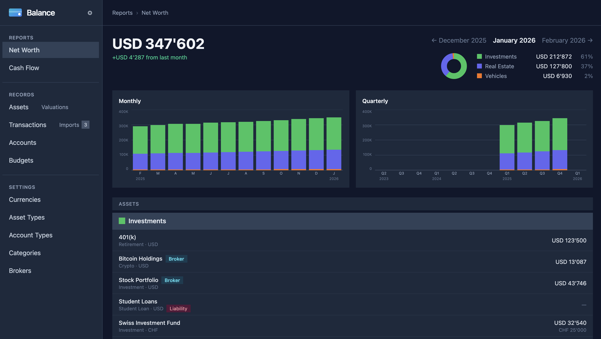
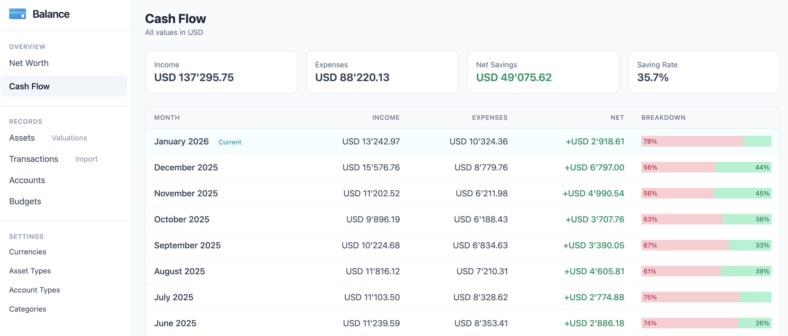

# Balance

A personal finance budgeting application for tracking income, expenses, budgets, and assets with a clean, mobile-friendly web interface.





## Features

### Net Worth & Assets
- **Net Worth Tracking** - Monitor assets and liabilities with donut charts, monthly/quarterly bar charts, and historical trends
- **Asset Valuations** - Bulk edit asset values across multiple months with copy-forward functionality
- **Asset Groups** - Organize assets into customizable groups with color coding
- **Multi-Currency Support** - Track accounts and assets in different currencies (USD, EUR, GBP, CHF, etc.)

### Cash Flow & Transactions
- **Cash Flow Dashboard** - 12-month income/expense overview with saving rate tracking
- **Transactions** - Record and categorize income and expenses across multiple accounts
- **AI-Powered Import** *(experimental)* - Import transactions from bank statements (CSV/PDF) using local LLM
- **Budget Management** - Set monthly and yearly budgets with visual progress indicators

### General
- **Dashboard Overview** - Quick snapshot of net worth and recent cash flow at a glance
- **Mobile-First Design** - Responsive interface optimized for mobile and desktop

## Running with Docker Compose

### Prerequisites

- Docker and Docker Compose installed
- (Optional) [Ollama](https://ollama.ai) for AI-powered transaction import

### Quick Start

1. Create a `docker-compose.yml` file:
   ```yaml
   services:
     web:
       image: ghcr.io/tma/balance:main
       ports:
         - "3000:80"
       env_file: .env
       volumes:
         - balance_storage:/rails/storage
       restart: unless-stopped
       depends_on:
         - worker

     worker:
       image: ghcr.io/tma/balance:main
       command: bundle exec rails solid_queue:start
       env_file: .env
       volumes:
         - balance_storage:/rails/storage
       restart: unless-stopped

   volumes:
     balance_storage:
   ```

2. Create a `.env` file with your configuration:
   ```bash
   # Generate with: openssl rand -hex 64
   SECRET_KEY_BASE=<your-secret-key>

   # Active Record encryption keys (required for broker integration)
   # Generate each with: openssl rand -hex 16
   ACTIVE_RECORD_ENCRYPTION_PRIMARY_KEY=<your-key>
   ACTIVE_RECORD_ENCRYPTION_DETERMINISTIC_KEY=<your-key>
   ACTIVE_RECORD_ENCRYPTION_KEY_DERIVATION_SALT=<your-key>

   # Timezone (e.g., America/New_York, Asia/Tokyo, Europe/Berlin)
   TZ=Europe/Berlin

   # Fallback currency if no default is set in the database (optional)
   DEFAULT_CURRENCY=CHF

   # Ollama host for AI-powered transaction import (optional)
   OLLAMA_HOST=http://ollama.example.com:11434
   # OLLAMA_MODEL=llama3.1:8b                  # LLM model (default: llama3.1:8b)
   # OLLAMA_EMBEDDING_MODEL=mxbai-embed-large  # Embedding model (default: mxbai-embed-large)
   # OLLAMA_EMBEDDING_CONFIDENCE=0.75          # Confidence threshold (default: 0.75)
   ```

   > **Important:** Save these values securely. If you lose the encryption keys, any encrypted data (like broker API tokens) will become unreadable.

3. Start the application:
   ```bash
   docker compose up -d
   ```

4. The application will be available at **http://localhost:3000**

5. On first run, the database will be seeded with default currencies, categories, and account types.

### Background Worker

The `worker` service runs scheduled jobs including:
- **Daily broker sync** (4am) - Fetches latest positions from connected brokers (e.g., Interactive Brokers)
- **Hourly pattern learning** - Extracts category patterns from transaction history using LLM
- **Daily categorization maintenance** - Prunes stale patterns and refreshes embeddings

### AI-Powered Transaction Import

To enable AI-powered transaction import from bank statements:

1. Install and run [Ollama](https://ollama.ai) on your host machine
2. Pull the required models:
   ```bash
    ollama pull mxbai-embed-large  # Required for categorization
   ollama pull llama3.1:8b       # Required for CSV format detection and PDF parsing
   ```
3. Set `OLLAMA_HOST` in your `.env` file to point to your Ollama instance

#### How Categorization Works

Transaction categorization uses a 3-phase hybrid approach:

1. **Pattern Matching** - Instant matching against category patterns (e.g., "Whole Foods" → Groceries)
2. **Embedding Similarity** - Semantic matching using vector embeddings when patterns don't match
3. **LLM Fallback** - For ambiguous cases, the LLM chooses from the top 3 embedding candidates

This approach reduces LLM calls by ~70-80% while maintaining high accuracy.

## Broker Connections

Balance can automatically sync positions from supported brokers to track your investment portfolio.

### Interactive Brokers (IBKR)

To connect your Interactive Brokers account, you need to create a Flex Query and generate an access token.

#### 1. Create a Flex Query

1. Log in to [IBKR Client Portal](https://www.interactivebrokers.com/portal)
2. Navigate to **Performance & Reports** → **Flex Queries**
3. Click **+** to create a new Activity Flex Query
4. Configure the query:
   - **Query Name**: e.g., "Balance Sync"
   - **Output Format**: XML
   - **Date Period**: Last 7 Calendar Days (or your preference)

5. Add the following sections and fields:

   **Account Information** (required for currency conversion):
   - Currency

   **Open Positions** (required):
   - Symbol
   - Description
   - Currency
   - FX Rate to Base
   - Quantity
   - Position Value
   - Listing Exchange
   - Level of Detail

   **Cash Report** (optional, for cash balances):
   - Currency
   - Ending Cash
   - FX Rate to Base

6. Save the query and note the **Query ID** (shown in the Flex Queries list)

#### 2. Generate a Flex Web Service Token

1. In Client Portal, go to **Settings** → **Reporting** → **Flex Web Service**
2. Generate a new token
3. Copy and securely store the token (it's only shown once)

#### 3. Add the Connection in Balance

1. Go to **Assets** → **Broker Connections** → **New Connection**
2. Select **Interactive Brokers** as the broker type
3. Enter:
   - **Name**: A friendly name for the connection
   - **Account ID**: Your IBKR account ID (e.g., U1234567)
   - **Flex Token**: The token you generated
   - **Flex Query ID**: The query ID from step 1

4. Click **Test Connection** to verify, then **Save**

#### Currency Conversion

When your IBKR account's base currency matches Balance's default currency, the app uses IBKR's exchange rates directly. Otherwise, it fetches historical rates from [Frankfurter API](https://www.frankfurter.app/).

### Stopping the Application

```bash
docker compose down
```

### Persistent Data

All data (transactions, accounts, assets) is stored in the `balance_storage` Docker volume and persists between restarts.

## Environment Variables

| Variable | Required | Default | Description |
|----------|----------|---------|-------------|
| `SECRET_KEY_BASE` | Yes | — | Rails secret key for session encryption. Generate with `openssl rand -hex 64` |
| `TZ` | No | `UTC` | Timezone for the application (e.g., `Europe/Zurich`, `America/New_York`) |
| `DEFAULT_CURRENCY` | No | `USD` | Fallback currency code (ISO 4217) if no default is set in the database |
| `ACTIVE_RECORD_ENCRYPTION_PRIMARY_KEY` | Yes* | — | Primary key for Active Record encryption. Generate with `openssl rand -hex 16` |
| `ACTIVE_RECORD_ENCRYPTION_DETERMINISTIC_KEY` | Yes* | — | Deterministic key for Active Record encryption. Generate with `openssl rand -hex 16` |
| `ACTIVE_RECORD_ENCRYPTION_KEY_DERIVATION_SALT` | Yes* | — | Salt for key derivation. Generate with `openssl rand -hex 16` |
| `OLLAMA_HOST` | No | — | Ollama API URL for AI-powered transaction import (e.g., `http://localhost:11434`) |
| `SOLID_QUEUE_IN_PUMA` | No | — | Set to `1` to run Solid Queue within Puma (single-process mode) |
| `JOB_CONCURRENCY` | No | `1` | Number of Solid Queue worker processes |

\* Required for broker integration (stores encrypted API tokens)

## Development

### Prerequisites

- Docker and Docker Compose

### Setup

1. Clone the repository
2. Start the devcontainer:
   ```bash
   docker compose -f .devcontainer/docker-compose.yml up -d
   ```
3. Start the development server:
   ```bash
   docker exec -d balance-devcontainer bin/dev
   ```
4. Open http://localhost:3000

### Running Tests

```bash
docker exec balance-devcontainer bin/rails test
docker exec balance-devcontainer rubocop
```

### Category Embeddings

Category embeddings are computed automatically when seeding the database or when category names/patterns change. To manually manage embeddings:

```bash
# Compute embeddings for all categories
docker exec balance-devcontainer bin/rails categories:compute_embeddings

# View embedding status
docker exec balance-devcontainer bin/rails categories:embedding_status

# Clear all embeddings (for troubleshooting)
docker exec balance-devcontainer bin/rails categories:clear_embeddings
```

## Tech Stack

- Ruby on Rails 8.x
- SQLite database
- Tailwind CSS
- Hotwire (Turbo + Stimulus)
- Solid Queue (background jobs)
- Ollama (local LLM for AI features)

## License

See [LICENSE](LICENSE) file for details.
